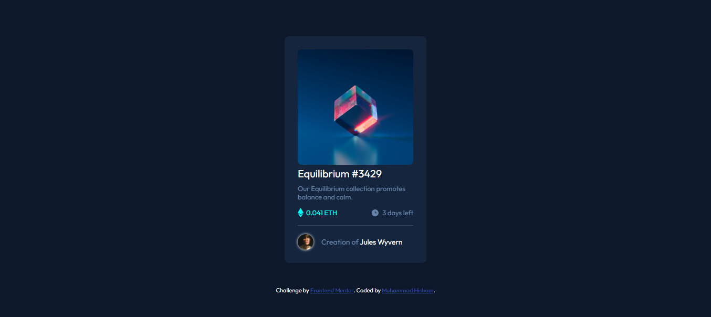

# Frontend Mentor - NFT preview card component solution

This is a solution to the [NFT preview card component challenge on Frontend Mentor](https://www.frontendmentor.io/challenges/nft-preview-card-component-SbdUL_w0U). Frontend Mentor challenges help you improve your coding skills by building realistic projects.

## Table of contents

- [Overview](#overview)
  - [The challenge](#the-challenge)
  - [Screenshot](#screenshot)
  - [Links](#links)
- [My process](#my-process)
  - [Built with](#built-with)
  - [Useful resources](#useful-resources)
- [Author](#author)

## Overview

### The challenge

Users should be able to:

- View the optimal layout depending on their device's screen size
- See hover states for interactive elements

### Screenshot

### Links

- Solution URL: [Add solution URL here](https://your-solution-url.com)
- Live Site URL: [Add live site URL here](https://your-live-site-url.com)

## My process

### Built with

- Semantic HTML5 markup
- CSS custom properties
- Flexbox
- CSS Grid
- Mobile-first workflow

### Useful resources

- [Filter CSS](https://developer.mozilla.org/en-US/docs/Web/CSS/filter) - This helped me for adding shadow around the avatar image. I really liked this pattern and will use it going forward.
- [Media Query Guide](https://css-tricks.com/a-complete-guide-to-css-media-queries/) - This is an amazing article which helped me finally understand how to use media query. I'd recommend it to anyone still learning this concept.

## Author

- Frontend Mentor - [@mohamedhesham221](https://www.frontendmentor.io/profile/mohamedhesham221)
- Linkedin - [Muhammad Hisham](https://www.linkedin.com/in/muhammad-hisham-23544b253/)
